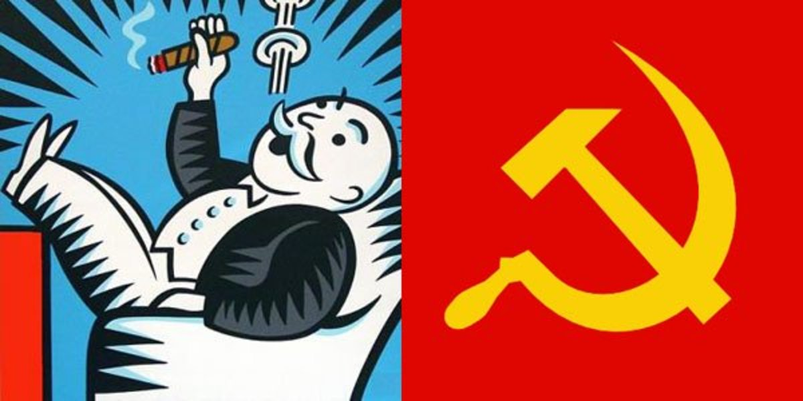

# Applied Data Science @ Columbia
## Spring 2023
## Project 1: A "data story" on the history of philosophy



### [Project Description](doc/)
This is the first and only *individual* (as opposed to *team*) project this semester. 

Term: Spring 2023

+ Projec title: when communism philosophers meet capitalism philosophers
+ This project is conducted by [Liang Hu]

+ Project summary: [a short summary] Capitalism and communism are two different economic and political ideologies with distinct philosophical underpinnings. Capitalism is an economic system in which private individuals and businesses own the means of production and are free to invest, produce, and trade goods and services as they see fit, rooted in individualism. On the other hand, communism is an economic and political system in which the means of production are owned and controlled by the community as a whole, rooted in collectivism. In this project, I will use word frequncy, emotion anlaysis, and LDA modelling technqiue to image the situation that if one of the communism philosophers met with one of capitalism philosophers. I will guess what their topics and what will they say. 

Following [suggestions](http://nicercode.github.io/blog/2013-04-05-projects/) by [RICH FITZJOHN](http://nicercode.github.io/about/#Team) (@richfitz). This folder is orgarnized as follows.

```
proj/
├── lib/
├── data/
├── doc/
├── figs/
└── output/
```

Please see each subfolder for a README file.
