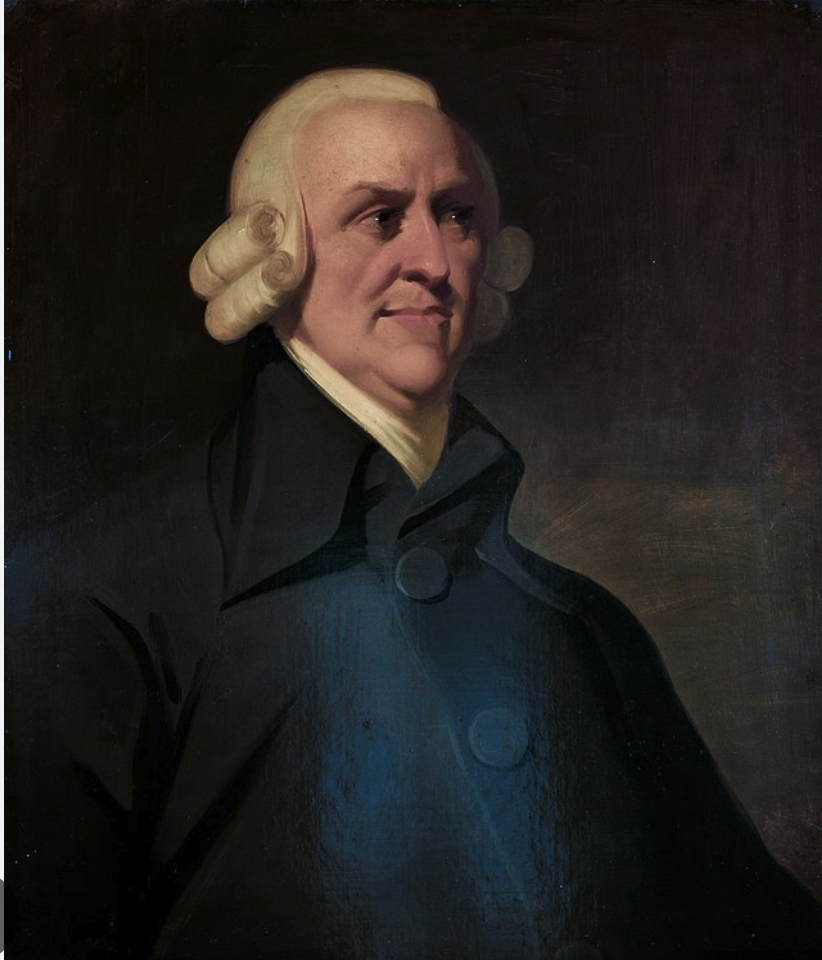
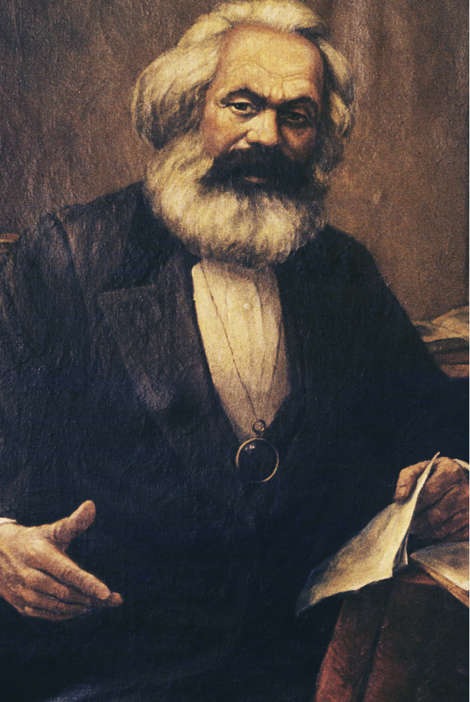

Philosophy Data Story Liang Hu 01/23/2022

### when communism philosophers meet capitalism philosophers


### Introduction:
Communism and capitalism are two different economic and political ideologies that have had a significant impact on the development of modern society.
Both ideologies have their roots in philosophy, and they have been the subject of much debate and discussion throughout history.

Communism, as a political and economic system, is based on the idea that all individuals should have equal access to the means of production, and that the state should control and own these means.
This system is intended to eliminate class distinctions and create a society where everyone has equal opportunity and access to resources.
The philosopher Karl Marx is considered the father of communism, and his ideas have been influential in the development of communist societies throughout the world.

Capitalism, on the other hand, is an economic system in which private individuals and businesses own the means of production, and the economy is driven by the profit motive.
The state plays a limited role in the economy, and individuals are free to own property, start businesses, and compete in the market.
The philosopher Adam Smith is considered the father of capitalism, and his ideas about laissez-faire economics have been influential in the development of capitalist societies throughout the world.

This report is a guidebook with selected Q&A aims at finding out the personality of representative capitalism philosopher and representative communism philosophers. Also, investigating what are the potential topics they may discuss if they meet.

### Question:

1.  What is the most frequency word the communism philosopher and capitalism philosophers use in sentences ?

2.  What is the characteristic of Communism philosophers and capitalism philosophers ?

3.  What are the possible topics that Communism philosophers and Capitalism philosophers will tend to talk about ?

```{r}
library(magrittr) # needs to be run every time you start R and want to use %>%
library(dplyr)    # alternatively, this also loads %>%
library(tidyverse)
library(tidytext)
library(ggplot2)
library(dplyr)
library(tidyr)
library(wordcloud)
library(tm)
library(topicmodels)
library(RColorBrewer)
```

```{r}
d=read.csv("../data/philosophy_data.csv")
```

```{r}
capitalism = subset(d, school == "capitalism")
communism =subset(d, school=="communism")
```

### Q1. What is the most frequency word the communism philosopher and capitalism philosophers use in sentences ?

```{r}
tidy_communism <- communism %>% 
  unnest_tokens(word, sentence_str) %>%
  anti_join(stop_words) %>%
  count(word)%>% 
  filter(n >500)%>% 
  arrange(desc(n))
#write.csv(tidy_communism, "../output/com_word_freq.csv", row.names=FALSE)
tidy_communism
```

```{r}
hist(tidy_communism$n)
```

  First, I try to clear out two word frequency csv files, in order to do the frequency analysis.Then,according to the word frequency, communism have unbelievable emphasize on labor.Communism is a political and economic ideology that emphasizes the collective ownership of the means of production and the elimination of social classes. This is often achieved through the centralization of labor power and the distribution of wealth and resources based on the principle of "from each according to their ability, to each according to their need." The goal of communism is to improve the living standards of ordinary workers and create a more equitable society.

```{r}
tidy_capitalism <- capitalism %>% 
  unnest_tokens(word, sentence_str) %>%
  anti_join(stop_words) %>%
  count(word)%>% 
  filter(n >500)%>% 
  arrange(desc(n))

# write.csv(tidy_capitalism, "../output/cap_word_freq.csv", row.names=FALSE)
tidy_capitalism
```

```{r}
hist(tidy_capitalism$n)

```

  The most commonly used words in discussions about communism are "price", "money" and "labor" that focus on the ordinary workers.
The top 10 words chosen by people discussing capitalism may vary, but they are likely to focus on business-related concepts which is based on private ownership of the means of production and the creation of goods and services for profit

  The following two work clouds can show different concerns that two ideologies.
We can understand although there are two total different ideologies in the society.
They still have relative high similar words.
The most common words for communism are labor and capital.
On the other hand, capitalism philosophers tend to use the word like price and money which answer the first question.
This may indicate that despite the fundamental differences, both ideologies share some common concerns, such as economy, society, and government.
Additionally, it's also important to note that language used to discuss these ideologies may be similar, but the context and perspective can change the meaning of the words.

```{r}
wordcloud(words =tidy_communism$word, freq=tidy_communism$n, max.words =100, 
          colors=brewer.pal(8, "Dark2"))

wordcloud(words =tidy_capitalism$word, freq=tidy_capitalism$n, max.words =100, 
          colors=brewer.pal(8, "Dark2"))

```

```{r}
  all_capitalism <- capitalism %>% 
  unnest_tokens(word, sentence_str) %>%
  anti_join(stop_words) %>%
  count(word)%>% 
  arrange(desc(n))
```

```{r}
  all_communism <- communism %>% 
  unnest_tokens(word, sentence_str) %>%
  anti_join(stop_words) %>%
  count(word)%>% 
  arrange(desc(n))
```

### Q2. What is the characteristic of communism philosophers and capitalism philosophers ?

```{r}
library("textdata")
```

```{R}
  sentiments_capitalism= all_capitalism %>%
  inner_join(get_sentiments("nrc")) %>% 
  filter(sentiment %in% c("anticipation", "joy", "surprise", "trust",
                 "anger", "disgust", "fear", "sadness" ))
```

```{r}

new2=sentiments_capitalism %>% 
  count(sentiment) %>% 
  # Arrange the sentiment counts in descending order
  arrange(desc(n))

```

```{r}
sentiments_capitalism %>%
  group_by(sentiment) %>%
  top_n(5, n) %>%
  ungroup() %>%
  mutate(word = reorder(word, n)) %>%
  ggplot(aes(word,n, fill=sentiment, label=n )) +
  geom_bar(stat="identity") + 
  coord_flip()
```

```{r}
sentiments_capitalism %>%
  group_by(sentiment) %>%
  top_n(5, n) %>%
  ungroup() %>%
  mutate(word = reorder(word, n)) %>%
  # Set up the plot with aes()
  ggplot(aes(word,n, fill=sentiment)) +
  geom_col(show.legend = FALSE) +
  facet_wrap(~ sentiment, scales = "free") +
  coord_flip()
```

```{r}
col.use=c("darkgoldenrod1", "darkgoldenrod2", "darkgoldenrod3", "darkgoldenrod4",
            "red2", "chartreuse3", "blueviolet","dodgerblue3")
barplot(new2$n, las=2, horiz=T, col=col.use[order(new2$n)], names.arg=new2$sentiment, main="capitalism philosophers")
```

```{R}
sentiments_capitalism %>% 
  count(sentiment) %>% 
  # Arrange the sentiment counts in descending order
  arrange(desc(n))
```

```{R}
  sentiments_communism= all_communism %>%
  inner_join(get_sentiments("nrc")) %>% 
  filter(sentiment %in% c("anticipation", "joy", "surprise", "trust",
                 "anger", "disgust", "fear", "sadness" ))
```

```{R}
new1 = sentiments_communism %>% 
  count(sentiment) %>% 
  # Arrange the sentiment counts in descending order
  arrange(desc(n))
new1
```

```{r}
sentiments_communism %>%
  group_by(sentiment) %>%
  # Take the top 10 words for each sentiment
  top_n(5, n) %>%
  ungroup() %>%
  mutate(word = reorder(word, n)) %>%
  ggplot(aes(word,n, fill=sentiment, label=n )) +
  geom_bar(stat="identity") + 
  coord_flip()
```

```{r}
sentiments_communism %>%
  group_by(sentiment) %>%
  top_n(5, n) %>%
  ungroup() %>%
  mutate(word = reorder(word, n)) %>%
  ggplot(aes(word,n, fill=sentiment)) +
  geom_col(show.legend = FALSE) +
  facet_wrap(~ sentiment, scales = "free") +
  coord_flip()
```

```{r}
col.use=c("darkgoldenrod1", "darkgoldenrod2", "darkgoldenrod3", "darkgoldenrod4",
            "red2", "chartreuse3", "blueviolet","dodgerblue3")
barplot(new1$n, las=2, horiz=T, col=col.use[order(new1$n)], names.arg=new1$sentiment, main="communism philosophers")
```

  After doing the word frequency perspective, I want to do the emotional analysis to investigate their characteristic.  IN general, capitalism philosophers in general have less surprise, less trust, less disgust in their sentences.
The similarity are their opinion towards happy and sadness. The mainly differences are the perspective of disgust.
Communism philosophers have anger on slavery and death.
  In comparison, capitalism philosophers tend to have anger on abundance or prohibited the words that shows low profit.
Also, capitalism philosopher have less trust and less surprise toward the public.
These characteristic reflect their personalities are more calm and peace.

### Q3. What are the possible topics that Communism philosophers and Capitalism philosophers will tend to talk about ?

```{r}
library("reshape2")
```

```{r}
communism = subset(d, author == "Marx")
capitalism =subset(d, author=="Smith")
```

```{r}
  tidy_communism <- communism %>% 
  unnest_tokens(word, sentence_str) %>%
  anti_join(stop_words) 
dtm_communism = tidy_communism %>%
  count(word, author) %>% 
  # Cast the word counts into a DTM
  cast_dtm(author, word, n)
```

```{r}
  tidy_capitalism <- capitalism %>% 
  unnest_tokens(word, sentence_str) %>%
  anti_join(stop_words) 
dtm_capitalism = tidy_capitalism%>%
  count(word, author) %>% 
  # Cast the word counts into a DTM
  cast_dtm(author, word, n)
```

```{r}

#Number of topics
k <- 5
#Run LDA using Gibbs sampling
ldaOut <-LDA(dtm_capitalism, k, method="Gibbs")
#write out results
#docs to topics
ldaOut.topics <- as.matrix(topics(ldaOut))
table(c(1:k, ldaOut.topics))
ldaOut.topics
```

```{r}
terms.beta=ldaOut@beta
terms.beta=scale(terms.beta)
topics.terms=NULL
for(i in 1:k){
  topics.terms=rbind(topics.terms, ldaOut@terms[order(terms.beta[i,], decreasing = TRUE)[1:5]])
}
topics.terms
```



```{r}
k <- 5
#Run LDA using Gibbs sampling
ldaOut <-LDA(dtm_communism, k, method="Gibbs")
#write out results
#docs to topics
ldaOut.topics <- as.matrix(topics(ldaOut))
table(c(1:k, ldaOut.topics))
ldaOut.topics
```

```{r}
terms.beta=ldaOut@beta
terms.beta=scale(terms.beta)
topics.terms=NULL
for(i in 1:k){
  topics.terms=rbind(topics.terms, ldaOut@terms[order(terms.beta[i,], decreasing = TRUE)[1:5]])
}
topics.terms
```



 
 
 
  According to the LDA analysis that learn in the class, the representation of Communism philosopher Marx will tend to say about why the workers don't have enough payment all the time. The workers are always hungry and poor.
Then, the representation of Capitalism philosophers, Smith will argue that we need to build the country.
There are overwhelming demanding that the labor need to do.
Also, He believed that the labor market, when left to its own devices, will adjust itself to balance supply and demand.

### Question:

1.  What is the most frequency word the communism philosopher and capitalism philosophers use in sentences ?

2.  What is the characteristic of Communism philosophers and capitalism philosophers ?

3.  What are the possible topics that Communism philosophers and Capitalism philosophers will tend to talk about ?

### Conclusions

1.  The most common used words for communism philosopher are "labor", "capital", and production.
    Also, the most frequency words that capitalism philosopher used are "price", "money", and "labor"

2.  The characteristic of capitalism philosophers are innovative, leading to greater efficiency, and calm.
    In comparison, communism philosophers tend to have anger on abundance or prohibited the words that shows low profit.

3.  Marx may asked Smith to focus on labor life quality.
    Then, Smith will argue that efficiency on production and principle of a free market is the core topic.
    They may argue about society and the public in the following topics.
